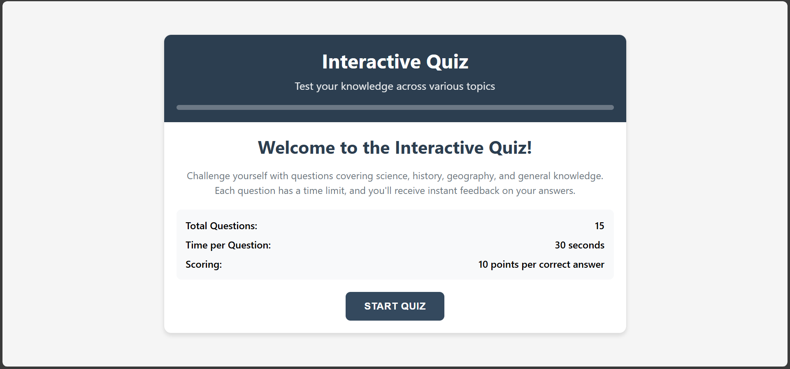
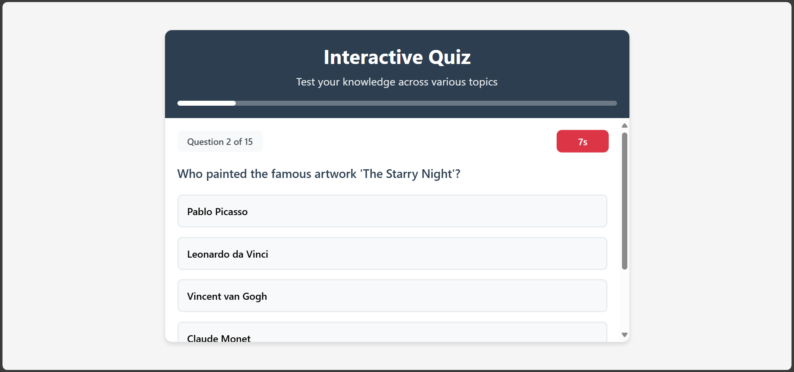
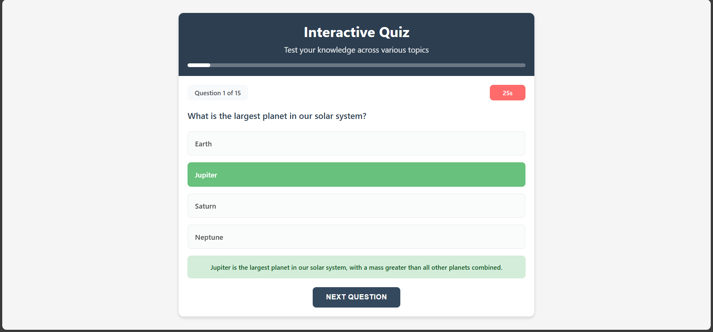
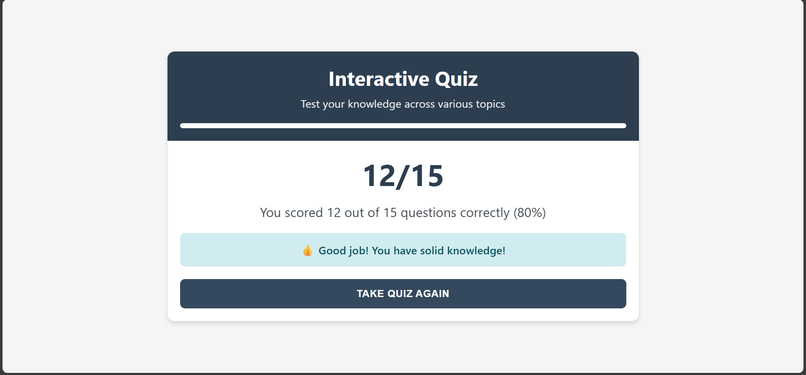

# Interactive Quiz Application

A modern, responsive web-based quiz application built with vanilla HTML, CSS, and JavaScript. Test your knowledge across various topics including science, history, geography, and general knowledge.

## Features

- **15 Diverse Questions** - Covering science, history, geography, and general knowledge
- **Timed Questions** - 30-second countdown timer for each question
- **Instant Feedback** - Immediate response with detailed explanations
- **Progress Tracking** - Visual progress bar and question counter
- **Responsive Design** - Optimized for desktop, tablet, and mobile devices
- **Score Calculation** - 10 points per correct answer with performance categorization
- **Clean Interface** - Simple, professional design with neutral colors

## Screenshots

### Welcome Screen


### Quiz Question


### Answer Feedback


### Results Screen


## How to Use the Quiz App

### Getting Started
1. **Download or Clone**
   ```bash
   git clone https://github.com/yourusername/interactive-quiz-app.git
   cd interactive-quiz-app
   ```

2. **Open in Browser**
   - Simply open `index.html` in your web browser
   - No build process or dependencies required

### Taking the Quiz

#### Step 1: Welcome Screen
- Read the quiz instructions and overview
- Click the **"Start Quiz"** button to begin

#### Step 2: Answering Questions
- **Read the question** carefully at the top
- **Choose your answer** by clicking one of the 4 multiple choice options
- **Watch the timer** - you have 30 seconds per question
- **Selected answers** are highlighted in blue

#### Step 3: Getting Feedback
- After selecting an answer, you'll see immediate feedback
- **Correct answers** show a green checkmark with explanation
- **Incorrect answers** show a red X with the correct answer and explanation
- **Progress bar** shows how many questions you've completed

#### Step 4: Moving Forward
- Click **"Next Question"** to continue to the next question
- The quiz will NOT auto-advance - you control the pace

#### Step 5: View Results
- After all 15 questions, see your final score
- View your **performance category**:
  - 130-150 points: Excellent
  - 100-120 points: Good
  - 70-90 points: Average
  - Below 70 points: Needs Improvement
- Click **"Restart Quiz"** to try again

### Tips for Best Experience
- **Use a stable internet connection** for smooth operation
- **Enable JavaScript** in your browser
- **Use modern browsers** (Chrome, Firefox, Safari, Edge)
- **Take your time** - there's no rush between questions

## File Structure

```
interactive-quiz-app/
├── .github/
│   └── workflows/
│       └── deploy.yml  # GitHub Pages deployment workflow
├── screenshots/
│   ├── welcome-screen.png
│   ├── quiz-question.png
│   ├── answer-feedback.png
│   └── results-screen.png
├── index.html          # Main HTML structure
├── styles.css          # All styling and responsive design
├── script.js           # Quiz logic and functionality
└── README.md           # This file
```

## Technology Stack

- **HTML5** - Semantic markup and structure
- **CSS3** - Responsive design with flexbox and grid
- **Vanilla JavaScript** - No frameworks or libraries
- **Mobile-First Design** - Optimized for all screen sizes

## Browser Support

- Chrome (latest)
- Firefox (latest)
- Safari (latest)
- Edge (latest)
- Mobile browsers (iOS Safari, Chrome Mobile)

## Features in Detail

### Quiz Flow
1. **Welcome Screen** - Introduction with quiz information
2. **Question Display** - Questions with multiple choice answers
3. **Timer System** - 30-second countdown with visual feedback
4. **Answer Selection** - Click to select with hover effects
5. **Instant Feedback** - Explanations for correct/incorrect answers
6. **Progress Tracking** - Visual progress bar throughout quiz
7. **Results Screen** - Final score with performance message

### Responsive Design
- **Mobile (≤480px)** - Stacked layout with full-width buttons
- **Tablet (481-768px)** - Balanced layout with optimized spacing
- **Desktop (769px+)** - Full-featured layout with side-by-side elements
- **Touch-Friendly** - Proper tap targets and touch interactions

### Performance Features
- **Lightweight** - No external dependencies
- **Fast Loading** - Optimized CSS and JavaScript
- **Smooth Animations** - CSS transitions and transforms
- **Accessibility** - Proper contrast and keyboard navigation

## Customization

### Adding Questions
Edit the `quizData` array in `script.js`:

```javascript
const quizData = [
    {
        question: "Your question here?",
        options: ["Option 1", "Option 2", "Option 3", "Option 4"],
        correct: 0, // Index of correct answer (0-3)
        explanation: "Explanation of the correct answer."
    },
    // Add more questions...
];
```

### Changing Timer Duration
Modify the timer settings in `script.js`:

```javascript
let timeLeft = 30; // Change to desired seconds
```

### Styling Customization
The application uses CSS custom properties. Key colors can be changed in `styles.css`:

```css
:root {
    --primary-color: #2c3e50;
    --secondary-color: #34495e;
    --background-color: #f5f5f5;
    --timer-color: #e74c3c;
}
```

## Deployment

### GitHub Pages (Recommended)

This repository includes a GitHub Action workflow for automatic deployment to GitHub Pages:

1. **Fork or clone this repository** to your GitHub account
2. **Enable GitHub Pages** in your repository settings:
   - Go to Settings → Pages
   - Select "Deploy from a branch" as source
   - Choose "main" branch and "/ (root)" folder
   - Click Save
3. **Automatic deployment** - The included GitHub Action (`.github/workflows/deploy.yml`) will automatically deploy your app whenever you push to the main branch
4. **Access your app** at `https://yourusername.github.io/repository-name`

### Other Static Hosting Options

- **Netlify** - Drag and drop deployment
- **Vercel** - Git-based deployment
- **Surge.sh** - Command-line deployment

## Development

### Local Development
Use any local server to avoid CORS issues:

```bash
# Python 3
python -m http.server 8000

# Node.js
npx http-server

# PHP
php -S localhost:8000
```

### Code Structure
- **HTML** - Semantic structure with proper accessibility
- **CSS** - Mobile-first responsive design
- **JavaScript** - Modular functions with clear separation of concerns

## Contributing

1. Fork the repository
2. Create a feature branch (`git checkout -b feature/amazing-feature`)
3. Commit changes (`git commit -m 'Add amazing feature'`)
4. Push to branch (`git push origin feature/amazing-feature`)
5. Open a Pull Request

### Contribution Guidelines
- Maintain code style and formatting
- Add comments for complex logic
- Test on multiple browsers and devices
- Update README if adding new features

## License

This project is open source and available under the MIT License.

## Acknowledgments

- Questions curated from various educational sources
- Design inspired by modern web applications
- Built with accessibility and performance in mind

## Support

If you encounter any issues or have questions:

1. Check the [Issues](https://github.com/Kritik-Chaudhary/quiz-app/issues) page
2. Create a new issue with detailed description
3. Include browser information and steps to reproduce

## Future Enhancements

- [ ] Category-based questions
- [ ] Difficulty levels
- [ ] User accounts and progress tracking
- [ ] Sound effects and animations
- [ ] Question randomization
- [ ] Export results functionality
- [ ] Multiplayer support

---

**Made with vanilla web technologies**
